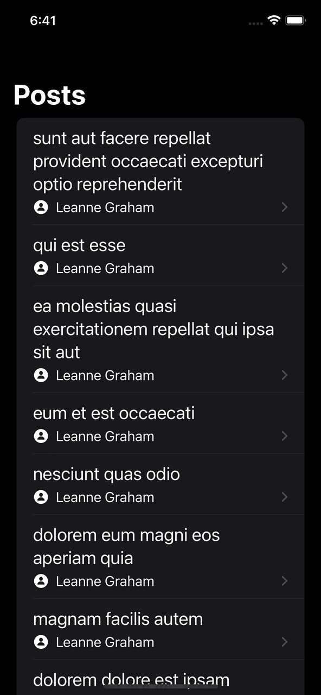

# baltic-amadeus-ios-task

This is an iOS app that displays a list of posts retrieved from an API save them to CoreData, and then make request to user detail API, when the post item appears and save the user details to CoreData.

## Technologies Used
This app is built using the following technologies:

Swift 5.5
SwiftUI
Async/Await
MVVM

## Files
Here's a brief description of each file in the project:

- Post.swift: Defines the Post struct that represents a post.
- User.swift: Defines the User struct that represents a user.
- PostRepository.swift: Provides methods for fetching posts from the API/CoreData.
- UserRepository.swift: Provides methods for fetching user data from the API/CoreData.
- PostsListViewModel.swift: Defines the view model that manages the list of posts displayed in the main view.
- PostsListView.swift: Defines the main view that displays the list of posts and handles navigation to the post detail view.
- PostView.swift: Defines the view that displays a single post in the list, including the user name and a progress indicator while user data is fetched.
- UserDetailView.swift: Defines the detail view that displays additional information about a user, including their name, email, and phone number.
- ErrorView.swift: Defines a view that displays an error message and a retry button.

##ScreenShot

